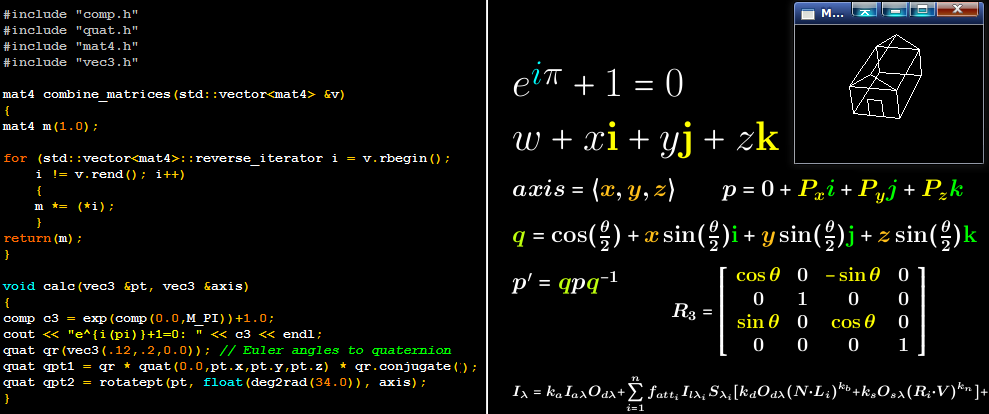

C++ 2d/3d/4d Vector, 2x2/3x3/4x4 Matrix, Complex Number, Quaternion, and 3d
Transformation Classes / Functions
==============================================================================

These classes allow the user to
simply code what they want without worrying about the implementation of these
data types.  For example, to multiply two 4x4 matrices (**`mat1`** and
**`mat2`**) together, just do **`mat1 * mat2`**.  Ever hear the hype about
quaternion rotation (being better than Euler rotation because of no gimbal lock,
etc.) but find it too confusing...  Just call
**`rotatept(point, angle, axisvector)`** - it will do the quaternion math for
you.  How easy is that?  Include my header files and enjoy coding.

I originally created these classes in order to more easily compile GLSL shaders
on the CPU instead of the GPU.  But then I went beyond what I needed for that
purpose, adding complex numbers, quaternions, and 3d transformations
/ projections.

I purposely didn't use features of C++11, C++14, C++17, C++20, etc. for my
classes, so they can be used in any environment.  I suppose the use of
**`INFINITY`** in one of the functions might be an exception, but it's contained
in an **`#ifdef`**, so the class will still compile.

Even though I don't use any modern C++ features, I feel that my classes are
also very educational due to their versatility and especially due to the
various implementation versions.

## Why So Many Versions?

As is typical in object-oriented languages, there are often many ways to do the
same thing.  This tends to create camps of people who feel you should do
this, you shouldn't do that, you should **ALWAYS** do this, and you should
**NEVER** do that, etc.  Partly to head off criticism of that nature and partly
to show complete examples of some of the various ways of doing things, I've
provided many different versions.  Choose for yourself which one/ones fit your
preferences.  And hopefully, C++ will be a little less confusing to you.

### All Friends

Making all overloaded operators friend functions is probably the easiest way to
do it.  Many potential type conflicts would be eliminated by declaring these
overloaded operators as friends.  However, there are pitfalls to this due to how
promiscuous it can be for everything to be friends.  But in the case of my
classes, there's no private data and no private functions, so I don't feel it's
as dangerous as it could be.  Now, some would say you should always have your
class variables be private.  But I feel most people would agree that using
getters and setters for a 3d vector class, for example, is needlessly tedious
and unnecessary.  Besides, as stated above, my initial goal was to mimic GLSL,
and GLSL allows access to the class variables without getters and setters.
At any rate, if friends offend you, here's some other ways:

### Not Friends, No Templates

One way to avoid potential type conflicts, such as when multiplying a double
literal by a float 3d vector, is to eliminate the template.  I've provided a
float version of this idea.  If you want a double version, you could easily
use your text editor to automatically search for all float and replace with
double.  But this approach to the type conflict problem can be limiting.
So, luckily there are other ways it can be done.

### Not Friends, Not Members

Technically, even though the friend functions were implemented inside the class,
they are not member functions.  So, in a sense this method isn't much of a
departure from the All Friends method.  But, it does require more work to
declare all the functions - each one needs it's own template.  And to avoid
the potential type conflicts, some functions require two parameter templates.
For example, some would be **`template <class T>`** and some would be
**`template <class T, class U>`** (**`U`** being for the non-class variable (a
float variable, for example)).  Hopefully, that made sense.  Note, earlier
compilers (such as Microsoft Visual C/C++ 6 for example) do have a problem with
some two parameter templates with overloaded operators, so if using those
compilers, you would have to stick with **`template <class T>`** and make the
non-class variable be of type **`T`**.  BTW, in many cases **`typename`** can
be used instead of **`class`**.

### Not Friends, Mostly Members

You may want to have the overloaded operators be member functions.  But
there's a catch - not all overloaded operators can be member functions.
Member functions require the left-hand side operand to be the same type
as the class the function is a member of.  So, if for example, you wanted
an overload of **`*`**, such that a **`float * vec3`** could be done (as
opposed to **`vec3 * float`**), that overload could not be a member function.
This creates, in my opinion, a messy combination of member and non-member
overloads.  But, if that's your preference, go for it.  But you might want to
try some other ways too...

### Alternate Ways

You can have all member overloads be declared inline and inside the class,
and keep the non-member overloads as friends (**`vec2a.h`**).  This is a little
less messy, but if you're totally against friends, this will not do.  So you
could put the non-member overloads outside the class as before (as in
Not Friends Not Members) (**`vec2b.h`**).  Messy, but maybe not as messy as
Mostly Members above.  And also a version that doesn't have two parameter
templates (**`vec2c.h`**).  You could also put the prototypes of the friend
functions in the class, but put the implementation outside the class, therefore
not inlined (**`vec2d.h`**).  But that is a lot of extra work.  You can also
make friend safer by doing it a different way, but it's even more work
(**`vec2e.h`**).  Here's an excerpt:

    friend Vec2 operator+<T> (const Vec2 &L, const Vec2 &R);

Here, **`Vec2`** doesn't have the **`<T>`**.  Inside a templated class, C++
assumes all references to that class are templated, so no need to specify it.
But that's not what makes it a little safer.  The **`<T>`** on the operator is.
This means only **`+`** operators of type **`T`** are friends with this class
of type **`T`**.  Now that we know **`<T>`** on **`Vec2`** isn't necessary, it
can be removed from the original All Friends version (**`vec2f.h`**).

I explain **`comp.h`** [here](#leave) (last item)

## Test Programs And Building Them

I've provided various test programs that test every function of my classes.
**`testall.cpp`** tests most functions (doesn't test some functions already
tested in **`testc.cpp`**, **`testq.cpp`**, and **`testmf.cpp`**).
**`testall2.cpp`** does what **`testall.cpp`** does but adds a few new
tests (swizzles and vector*=matrix), adds LaTeX code printing of matrices,
adds Pass/Fail determinations, and uses **`vmcq.h`** instead of including
the individual include files (and adding namespace vmcq).  For
comparison purposes, **`testcc.c`** shows the results of calling (GNU?) C's
(complex.h) complex number functions, and **`testccc.cpp`** shows the results
of calling C++'s complex number functions.  These results can be compared with
my class (**`comp.h`**).  And **`vgraph*.cpp`** shows what can be done with my
bonus 3d transformation / projection functions (**`matfunc.h`**).  Refer to
vgraph*.cpp for keyboard and mouse controls (for example, left mouse drag
rotates the scene according to mouse position, and pressing **`c`** puts the
axis of rotation in the (X-Z) center of the house).  And also **`qgraph*.cpp`**
shows what can be done with quaternion rotations.  And refer to all test
programs for examples of how to code with my classes.

To get started...
Go to the directory you installed this repo in (using terminal or cmd window).
From there,

    cd Test

**Then if using Linux, type:**

    make

to make everything, or:

    make AllFriends

to make the All Friends version, for example.  Same for the other versions.

To clean up things (remove the executables):

    make clean

**Or If using Microsoft Visual Studio in Windows,** make sure your MS-DOS
environment is set up correctly, and type:

    nmake /f Makefile.win

to make everything, or:

    nmake /f Makefile.win AllFriends

to make the All Friends version, for example.  Same for the other versions.

To clean up things (remove the executables):

    nmake /f Makefile.win clean

> **Note:** if you are using an older version of Visual C (specifically version
> 6), you'll need to use the other versions of **`CXXFLAGS`**, **`CFLAGS`**,
> and **`CXXFLAGSWIN`** in the **`Makefile.win`** file.
 
## Some Things I Leave Up to the Users of This Repo

There are various things that can still be done, but I'm leaving them up to
the users of this repo to implement if they so choose.  These include:

  - Add more **`typedef`**, or modify the ones already at the end of each
include file.  Like, for example, change float to double.  Or you may even want
to do away with typedef and use **`using`** (but that won't work in older
compilers).

  - Make full set versions (vec3, vec4, mat2, etc.) of the Alternate Ways
methods.  I created these for educational purposes to show even more ways of
doing the same thing.  But they're not necessarily the best or easiest ways.
Because of this, I saw no reason to implement a full set of each method.  You
may feel otherwise.

  - The Not Friends, Not Members version won't compile as is in Visual C/C++ 6
because of the two parameter templates.  If you need it to compile in this
compiler, get rid of the second parameter,  You may even want to use the
method I use in **`testc.cpp`** (using **`_MSC_VER`**).

  - You may want to break up each class file into two files - put the
interface / definitions in a header (**`.h`**) file and the implementation in a
source (**`.cpp`**) file.

  - ~~You may want to put the various classes and functions into their own
namespace or namespaces.~~  I did that one - include **`vmcq.h`** instead of
the individual include files, or just include the desired class include file
in a **`namespace vmcq { }`** block.

  - **`comp.h`** in AlternateWays (which is a modification of the
NotFriends_MostlyMembers comp.h, though it can be implemented in any of the
methods) shows how you could go about changing the
complex number printing method dynamically in your program.  No need to pick
just one format by using a **`#define`** (before including comp.h or any
include file that includes comp.h).  You can either add a line like:
**`comp::c_format = 1;`** to select format 1, for example, or you could pick
any comp variable (for example **`c3`**) and add this: **`c3.setFormat(1);`**.
Note: either of these methods changes all subsequent printings of any comp
variable (perhaps more accurately, Comp) of the instantiated type to be this
format (until another format setting occurs).  This idea can also be applied
to replace **`EPSILONCOMP`** if you desire.  Or even set the width and precision
of floating point number printing in the matrix classes.

## Disclaimers

  - My programming style in terms of formatting was forged during my (mainly) C
programming days, which in turn may have been influenced by my Pascal
programming days.  Some of these preferences don't always fit nicely with C++
(Java as well).  So, there may be some inconsistencies with formatting choices.
However, I will make NO apologies for the use of tabs (versus spaces) and the
refusal to use Egyptian braces.  I guess my style is similar to Whitesmiths.
BTW, I use a tab width of 4 spaces - the included **`.editorconfig`** files
should take care of that (I will agree that the default 8 space tabs would be
ridiculous).

  - I think I put **`const`** everywhere that's appropriate, but you never know.
It's generally more efficient to pass a pointer to a variable (call by
reference) rather than pass (copy) the variable (call by value), but this
causes the need for const to tell the compiler that you guarantee the function
will not change the value of the variable (after all, with const you can't).

  - In my early programming days, low memory and disk space usage (floppy and
harddrive) was critical.  Nowadays, speed is considered more important than
usage.  I will never advocate the "Who cares how much disk space or memory it
uses, you can always buy more" attitude.  But, for 3d graphics (of which you
may be using this repo for) speed is crucial.  So, in most cases, I inlined
functions and unrolled for loops - sacrificing disk space/memory for speed.
I hope I got the balance right.  But, maybe it doesn't matter anyway, since
there's a pretty good chance the compiler (if modern) will choose the best way
to do things.

  - The sample program **`vgraph*.cpp`** is not double buffered.  It's only
meant to show how you can use the classes/functions - it's not meant to be a
3d viewer.  If the flicker is a problem for you, press **`1`** or **`2`** to
get rid of the parallel and perspective projection together setting or press
**`left`** and **`right`** cursor keys to change the delay between frames.
**`qgraph*.cpp`** also isn't double buffered, but the flicker isn't as bad.

  - There are some comments in **`vec2.h`**, **`vec3.h`**, **`comp.h`**, and
**`quat.h`** that apply to all the headers, but are only mentioned in one of
them.  comp.h also has alternate ways (commented out) of calculating the values.
Feel free to try the other ways.  Both comp.h and quat.h have various options
you can **`#define`** to change from the default (for example, you can
customize how you want complex numbers and quaternions printed).

## Demonstration/Tutorial Video

Hopefully, coming soon.

## Author

Mark Craig
[https://www.youtube.com/MrMcSoftware](https://www.youtube.com/MrMcSoftware)

## Reference

For the sake of this reference section, I'll assume a template instantiation
of type **`float`** (via a **`typedef`**) and I'll remove all **`const`**.
Keep in mind it doesn't have to be float.

Quick Jumps:
* [Complex Numbers - comp.h](#complex)
* [Quaternions - quat.h](#quaternions)
* [2d Vector - vec2.h](#2d_vector)
* [3d Vector - vec3.h](#3d_vector)
* [4d Vector - vec4.h](#4d_vector)
* [2x2 Matrix - mat2.h](#2x2_matrix)
* [3x3 Matrix - mat3.h](#3x3_matrix)
* [4x4 Matrix - mat4.h](#4x4_matrix)
* [3d Transformations / Projections - matfunc.h](#3d_trans)

### Complex Numbers - comp.h
  - **Member Variable Access:**
    - **`r, i`**, **`real, imaginary`**, **`re, im`**, or **`V[2]`**
  - **Constructors:**
    - comp() { r=i=0; }
    - comp(float cr, float ci=0) { r=cr; i=ci; }
    - comp(comp &s) { r=s.r; i=s.i; }
    - comp(float v[2]) { r=v[0]; i=v[1]; }
  - **Inline Functions:**
    - comp square()
    - float dot()
    - float dot(comp &q)
    - float mag() // mag aka abs
    - float phase() // phase aka arg
    - comp normalized()
    - float normalize()
    - comp conjugate()
  - **operator  Overloads:**
    - inline float operator [] (int i)
    - inline float& operator [] (int i)
    - comp operator + (comp &L, comp &R)
    - comp operator + (comp &L, float &R)
    - comp operator + (float &L, comp &R)
    - comp operator - (comp &R)
    - comp operator - (comp &L, comp &R)
    - comp operator - (comp &L, float &R)
    - comp operator - (float &L, comp &R)
    - comp operator * (comp &L, comp &R)
    - comp operator * (float &L, comp &R)
    - comp operator * (comp &L, float &R)
    - comp operator / (comp &L, comp &R)
    - comp operator / (comp &L, float &R)
    - comp& operator += (comp &L, comp &R)
    - comp& operator += (comp &L, float &R)
    - comp& operator -= (comp &L, comp &R)
    - comp& operator -= (comp &L, float &R)
    - comp& operator *= (comp &L, comp &R)
    - comp& operator *= (comp &L, float &R)
    - comp& operator /= (comp &L, comp &R)
    - comp& operator /= (comp &L, float &R)
    - bool operator == (comp &L, comp &R)
    - bool operator != (comp &L, comp &R)
    - std::ostream& operator << (std::ostream &os, comp &R)
  - **Extra Functions:**
    - inline comp MagPhase2Complex(float &mag, float &phase)
    - inline float abs(comp &z1)
    - comp cos(comp &z1)
    - comp sin(comp &z1)  
    - comp ztoz(comp &z1)
    - comp cpow(comp &z1, float &p)
    - comp exp(comp &z1)
    - comp cosh(comp &z1)
    - comp sinh(comp &z1)
    - comp log(comp &z1)
    - comp log10(comp &z1)
    - comp log2(comp &z1)
    - comp tan(comp &z1)
    - comp tanh(comp &z1)
    - comp sqrt(comp &z1)
    - comp acos(comp &z1)
    - comp asin(comp &z1)
    - comp atan(comp &z1)
    - comp acosh(comp &z1)
    - comp asinh(comp &z1)
    - comp atanh(comp &z1)
    - comp cproj(comp &z1)
    - comp polar(float &rho, float &theta)
    - comp cpow(comp &z1, comp &z2)
    - comp cpow(float &x, comp &z2)
  - **#define**
    - **`C_DISPLAY_FORMAT`** : **`not defined: 1+j2`**, **`0: 1+j2`**, **`1: 1,2i`**, **`2: 1+2i`**, **`3: 1,2`**
    - **`EPSILONCOMP`** : **`not defined: no epsilon comparison`**, **`defined: compare with specified epsilon`**
    - **`EPSILONCOMPREL`** : **`not defined: absolute epsilon (no matter whether values are large or small)`**, **`defined: relative epsilon`**
    - **`VMCQ_NEEDMAX`** : **`not defined: std has max`**, **`defined: std doesn't have max`**
### Quaternions - quat.h
  - **Member Variable Access:**
    - **`w, x, y, z`**, **`X, Y, Z, W`**, or **`V[4]`**
  - **Optional Swizzles (If swizzles are enabled):**
    - **`yx`**, **`xy`**, **`yz`**, **`xz`**, **`zyx`**, **`xyz`**, **`XYZ`**, **`wzyx`**, **`WZYX`**
  - **Constructors:**
    - quat() { x=y=z=w=0; }
    - quat(float cw, float cx, float cy, float cz) { x=cx; y=cy; z=cz; w=cw; }
    - quat(vec3 &ea) // Euler angles
    - quat(quat &s) { x=s.x; y=s.y; z=s.z; w=s.w; }
    - quat(float v[4]) { w=v[0]; x=v[1]; y=v[2]; z=v[3]; }
    - quat(comp &c) { w=c.r; x=c.i; y=z=0; }
    - quat(float &s, vec3 &v) { w=s; x=v.x; y=v.y; z=v.z; }
    - quat(float &s) { w=s; x=y=z=0.0; }
  - **Inline Functions:**
    - quat square()
    - float dot()
    - float dot(quat &q)
    - float length()
    - quat normalized()
    - float normalize()
    - quat conjugate()
    - quat inverse()
    - float roll()
    - float pitch()
    - float yaw()
  - **operator  Overloads:**
    - inline float operator [] (int i)
    - inline float& operator [] (int i)
    - quat operator + (quat &L, quat &R)
    - quat operator - (quat &R)
    - quat operator - (quat &L, quat &R)
    - quat operator * (quat &L, quat &R)
    - quat operator * (float &L, quat &R)
    - quat operator * (quat &L, float &R)
    - vec3 operator * (quat &L, vec3 &R)
    - quat operator / (quat &L, quat &R)
    - quat operator / (quat &L, float &R)
    - quat& operator += (quat &L, quat &R)
    - quat& operator -= (quat &L, quat &R)
    - quat& operator *= (quat &L, quat &R)
    - quat& operator *= (quat &L, float &R)
    - quat& operator /= (quat &L, quat &R)
    - quat& operator /= (quat &L, float &R)
    - bool operator == (quat &L, quat &R)
    - bool operator != (quat &L, quat &R)
    - std::ostream& operator << (std::ostream &os, quat &R)
  - **Extra Functions:**
    - vec3 cross(vec3 &v, quat &q)
    - vec3 cross(quat &q, vec3 &v)
    - quat cross(quat &q1, quat &q2)
    - quat rotate(quat &q, float &a, vec3 &v)
    - vec3 rotatept(vec3 &p, float &a, vec3 &v)
    - void Quat2AxisAngle(quat &q, vec3 &axis, float &theta)
    - quat lerp(quat &q1, quat &q2, float &t)
    - quat mix(quat &q1, quat &q2, float &t)
    - quat slerp(quat &q1, quat &q2, float &t)
	- mat4 Quat2Mat4(quat &q, int normalize=0)
  - **#define**
    - **`Q_DISPLAY_FORMAT`** : **`not defined: 1,2i,3j,4k`**, **`0: 1,2i,3j,4k`**, **`1: 1+2i+3j+4k`**, **`2: 1,2,3,4`**
    - **`EPSILONCOMP`** : **`not defined: no epsilon comparison`**, **`defined: compare with specified epsilon`**
    - **`EPSILONCOMPREL`** : **`not defined: absolute epsilon (no matter whether values are large or small)`**, **`defined: relative epsilon`**
    - **`VMCQ_NEEDMAX`** : **`not defined: std has max`**, **`defined: std doesn't have max`**
    - **`EULER2QUAT_METHOD`** : **`not defined: 0`**, **`0`**, **`1`**, **`2`**
    - **`DONT_SWAP_PITCH_ROLL`**
    - **`DONT_SWAP_YAW_PITCH`**
    - **`VEC_USE_SWIZZLE`**
### 2d Vector - vec2.h
  - **Member Variable Access:**
    - **`x, y`**, **`s, t`**, **`u, v`**, or **`V[2]`**
  - **Optional Swizzles (If swizzles are enabled):**
    - **`yx`**
  - **Constructors:**
    - vec2() { x=y=0; }
    - vec2(float cx, float cy) { x=cx; y=cy; }
    - vec2(float cx) { x=y=cx; }
    - vec2(vec2 &v) { x=v.x; y=v.y; }
    - vec2(float v[2]) { x=v[0]; y=v[1]; }
  - **Inline Functions:**
    - vec2 yx()    (If swizzles are not enabled)
    - float dot()
    - float dot(vec2 &q)
    - float length()
    - vec2 normalized()
    - float normalize()
  - **operator  Overloads:**
    - float operator [] (int i)
    - float& operator [] (int i)
    - vec2 operator + (vec2 &L, vec2 &R)
    - vec2 operator + (vec2 &L, float &R)
    - vec2 operator + (float &L, vec2 &R)
    - vec2 operator - (vec2 &R)
    - vec2 operator - (vec2 &L, vec2 &R)
    - vec2 operator - (vec2 &L, float &R)
    - vec2 operator - (float &L, vec2 &R)
    - vec2 operator * (vec2 &L, vec2 &R)
    - vec2 operator * (float &L, vec2 &R)
    - vec2 operator * (vec2 &L, float &R)
    - vec2 operator / (vec2 &L, vec2 &R)
    - vec2 operator / (vec2 &L, float &R)
    - vec2& operator += (vec2 &L, vec2 &R)
    - vec2& operator += (vec2 &L, float &R)
    - vec2& operator -= (vec2 &L, vec2 &R)
    - vec2& operator -= (vec2 &L, float &R)
    - vec2& operator *= (vec2 &L, vec2 &R)
    - vec2& operator *= (vec2 &L, float &R)
    - vec2& operator *= (vec2 &L, mat2 &R)    (If vector/matrix interop enabled)
    - vec2& operator /= (vec2 &L, vec2 &R)
    - vec2& operator /= (vec2 &L, float &R)
    - vec2& operator ++ (vec2 &R)
    - vec2 operator ++ (vec2 &L, int)
    - vec2& operator -- (vec2 &R)
    - vec2 operator -- (vec2 &L, int)
    - bool operator == (vec2 &L, vec2 &R)
    - bool operator != (vec2 &L, vec2 &R)
    - std::ostream& operator << (std::ostream &os, vec2 &R)
  - **#define**
    - **`EPSILONCOMP`** : **`not defined: no epsilon comparison`**, **`defined: compare with specified epsilon`**
    - **`EPSILONCOMPREL`** : **`not defined: absolute epsilon (no matter whether values are large or small)`**, **`defined: relative epsilon`**
    - **`VMCQ_NEEDMAX`** : **`not defined: std has max`**, **`defined: std doesn't have max`**
    - **`VEC_USE_SWIZZLE`**
    - **`VEC_USE_MAT`**
### 3d Vector - vec3.h
  - **Member Variable Access:**
    - **`x, y, z`**, **`r, g, b`**, or **`V[3]`**
  - **Optional Swizzles (If swizzles are enabled):**
    - **`yx`**, **`xy`**, **`yz`**, **`xz`**, **`zyx`**, **`bgr`**
  - **Constructors:**
    - vec3() { x=y=z=0; }
    - vec3(float cx, float cy, float cz) { x=cx; y=cy; z=cz; }
    - vec3(float cx) { x=y=z=cx; }
    - vec3(vec2 v, float cz) { x=v.x; y=v.y; z=cz; }
    - vec3(vec3 &v) { x=v.x; y=v.y; z=v.z; }
    - vec3(float v[3]) { x=v[0]; y=v[1]; z=v[2]; }
  - **Inline Functions:**
    - vec2 xy()    (If swizzles are not enabled)
    - float dot()
    - float dot(vec3 &q)
    - vec3 cross(vec3 &q)
    - float length()
    - vec3 normalized()
    - float normalize()
  - **operator  Overloads:**
    - inline float operator [] (int i)
    - inline float& operator [] (int i)
    - vec3 operator + (vec3 &L, vec3 &R)
    - vec3 operator + (vec3 &L, float &R)
    - vec3 operator + (float &L, vec3 &R)
    - vec3 operator - (vec3 &R)
    - vec3 operator - (vec3 &L, vec3 &R)
    - vec3 operator - (vec3 &L, float &R)
    - vec3 operator - (float &L, vec3 &R)
    - vec3 operator * (vec3 &L, vec3 &R)
    - vec3 operator * (float &L, vec3 &R)
    - vec3 operator * (vec3 &L, float &R)
    - vec3 operator / (vec3 &L, vec3 &R)
    - vec3 operator / (vec3 &L, float &R)
    - vec3& operator += (vec3 &L, vec3 &R)
    - vec3& operator += (vec3 &L, float &R)
    - vec3& operator -= (vec3 &L, vec3 &R)
    - vec3& operator -= (vec3 &L, float &R)
    - vec3& operator *= (vec3 &L, vec3 &R)
    - vec3& operator *= (vec3 &L, float &R)
    - vec3& operator *= (vec3 &L, mat3 &R)    (If vector/matrix interop enabled)
    - vec3& operator /= (vec3 &L, vec3 &R)
    - vec3& operator /= (vec3 &L, float &R)
    - vec3& operator ++ (vec3 &R)
    - vec3 operator ++ (vec3 &L, int)
    - vec3& operator -- (vec3 &R)
    - vec3 operator -- (vec3 &L, int)
    - bool operator == (vec3 &L, vec3 &R)
    - bool operator != (vec3 &L, vec3 &R)
    - std::ostream& operator << (std::ostream &os, vec3 &R)
  - **#define**
    - **`EPSILONCOMP`** : **`not defined: no epsilon comparison`**, **`defined: compare with specified epsilon`**
    - **`EPSILONCOMPREL`** : **`not defined: absolute epsilon (no matter whether values are large or small)`**, **`defined: relative epsilon`**
    - **`VMCQ_NEEDMAX`** : **`not defined: std has max`**, **`defined: std doesn't have max`**
    - **`VEC_USE_SWIZZLE`**
    - **`VEC_USE_MAT`**
### 4d Vector - vec4.h
  - **Member Variable Access:**
    - **`x, y, z, w`**, **`r, g, b, a`**, or **`V[4]`**
  - **Optional Swizzles (If swizzles are enabled):**
    - **`yx`**, **`xy`**, **`yz`**, **`xz`**, **`zyx`**, **`bgr`**, **`xyz`**, **`rgb`**, **`wzyx`**, **`abgr`**
  - **Constructors:**
    - vec4() { x=y=z=w=0; }
    - vec4(float cx, float cy, float cz, float cw) { x=cx; y=cy; z=cz; w=cw; }
    - vec4(float cx) { x=y=z=w=cx; }
    - vec4(vec3 v, float cw) { x=v.x; y=v.y; z=v.z; w=cw; }
    - vec4(vec4 &v) { x=v.x; y=v.y; z=v.z; w=v.w; }
    - vec4(float v[4]) { x=v[0]; y=v[1]; z=v[2]; w=v[3]; }
  - **Inline Functions:**
    - vec2 xy()    (If swizzles are not enabled)
    - vec3 xyz()    (If swizzles are not enabled)
    - float dot()
    - float dot(vec4 &q)
    - float length()
    - vec4 normalized()
    - float normalize()
  - **operator  Overloads:**
    - inline float operator [] (int i)
    - inline float& operator [] (int i)
    - vec4 operator + (vec4 &L, vec4 &R)
    - vec4 operator + (vec4 &L, float &R)
    - vec4 operator + (float &L, vec4 &R)
    - vec4 operator - (vec4 &R)
    - vec4 operator - (vec4 &L, vec4 &R)
    - vec4 operator - (vec4 &L, float &R)
    - vec4 operator - (float &L, vec4 &R)
    - vec4 operator * (vec4 &L, vec4 &R)
    - vec4 operator * (float &L, vec4 &R)
    - vec4 operator * (vec4 &L, float &R)
    - vec4 operator / (vec4 &L, vec4 &R)
    - vec4 operator / (vec4 &L, float &R)
    - vec4& operator += (vec4 &L, vec4 &R)
    - vec4& operator += (vec4 &L, float &R)
    - vec4& operator -= (vec4 &L, vec4 &R)
    - vec4& operator -= (vec4 &L, float &R)
    - vec4& operator *= (vec4 &L, vec4 &R)
    - vec4& operator *= (vec4 &L, float &R)
    - vec4& operator *= (vec4 &L, mat4 &R)    (If vector/matrix interop enabled)
    - vec4& operator /= (vec4 &L, vec4 &R)
    - vec4& operator /= (vec4 &L, float &R)
    - vec4& operator ++ (vec4 &R)
    - vec4 operator ++ (vec4 &L, int)
    - vec4& operator -- (vec4 &R)
    - vec4 operator -- (vec4 &L, int)
    - bool operator == (vec4 &L, vec4 &R)
    - bool operator != (vec4 &L, vec4 &R)
    - std::ostream& operator << (std::ostream &os, vec4 &R)
  - **#define**
    - **`EPSILONCOMP`** : **`not defined: no epsilon comparison`**, **`defined: compare with specified epsilon`**
    - **`EPSILONCOMPREL`** : **`not defined: absolute epsilon (no matter whether values are large or small)`**, **`defined: relative epsilon`**
    - **`VMCQ_NEEDMAX`** : **`not defined: std has max`**, **`defined: std doesn't have max`**
    - **`VEC_USE_SWIZZLE`**
    - **`VEC_USE_MAT`**
### 2x2 Matrix - mat2.h
  - **Member Variable Access:**
    - **`m[2][2]`**, **`M[4]`**, or **`x0, x1, y0, y1`**
  - **Constructors:**
    - mat2() { x0=y0=x1=y1=0; }
    - mat2(float X0) { y0=x1=0; x0=y1=X0; }
    - mat2(float X0, float Y0, float X1, float Y1) { x0=X0; y0=Y0; x1=X1; y1=Y1; }
    - mat2(vec2 v1, vec2 v2) { x0=v1.x; y0=v1.y; x1=v2.x; y1=v2.y; }
    - mat2(mat2 &v) { x0=v.x0; y0=v.y0; x1=v.x1; y1=v.y1; }
  - **Inline Functions:**
    - mat2 transpose()
    - float determinant()
    - mat2 inverse()
    - void print(int nl=1)
    - void latex(int nl=1, bool fixedl=true, std::ostream &os=std::cout)
  - **operator  Overloads:**
    - mat2 operator + (mat2 &L, mat2 &R)
    - mat2 operator - (mat2 &R)
    - mat2 operator - (mat2 &L, mat2 &R)
    - vec2 operator * (mat2 &L, vec2 &R)
    - vec2 operator * (vec2 &L, mat2 &R)
    - mat2 operator * (mat2 &L, float &R)
    - mat2 operator * (float &L, mat2 &R)
    - mat2 operator * (mat2 &L, mat2 &R)
    - mat2 operator / (mat2 &L, float &R)
    - mat2 operator / (mat2 &L, mat2 &R)
    - mat2& operator += (mat2 &L, mat2 &R)
    - mat2& operator -= (mat2 &L, mat2 &R)
    - mat2& operator *= (mat2 &L, mat2 &R)
    - mat2& operator *= (mat2 &L, float &R)
    - mat2& operator /= (mat2 &L, mat2 &R)
    - mat2& operator /= (mat2 &L, float &R)
    - bool operator == (mat2 &L, mat2 &R)
    - bool operator != (mat2 &L, mat2 &R)
    - std::ostream& operator << (std::ostream &os, mat2 &R)
  - **#define**
    - **`EPSILONCOMP`** : **`not defined: no epsilon comparison`**, **`defined: compare with specified epsilon`**
    - **`EPSILONCOMPREL`** : **`not defined: absolute epsilon (no matter whether values are large or small)`**, **`defined: relative epsilon`**
    - **`VMCQ_NEEDMAX`** : **`not defined: std has max`**, **`defined: std doesn't have max`**
### 3x3 Matrix - mat3.h
  - **Member Variable Access:**
    - **`m[3][3]`**, **`M[9]`**, or **`x0, x1, x2, y0, y1, y2, z0, z1, z2`**
  - **Constructors:**
    - mat3() { x0=y0=z0=x1=y1=z1=x2=y2=z2=0; }
    - mat3(float X0) { y0=z0=x1=z1=x2=y2=0; x0=y1=z2=X0; }
    - mat3(float X0, float Y0, float Z0, float X1, float Y1, float Z1, float X2, float Y2, float Z2) { x0=X0; y0=Y0; z0=Z0; x1=X1; y1=Y1; z1=Z1; x2=X2; y2=Y2; z2=Z2; }
    - mat3(vec3 v1, vec3 v2, vec3 v3) { x0=v1.x; y0=v1.y; z0=v1.z; x1=v2.x; y1=v2.y; z1=v2.z; x2=v3.x; y2=v3.y; z2=v3.z; }
    - mat3(mat3 &v) { x0=v.x0; y0=v.y0; z0=v.z0; x1=v.x1; y1=v.y1; z1=v.z1; x2=v.x2; y2=v.y2; z2=v.z2; }
  - **Inline Functions:**
    - mat3 transpose()
    - float determinant()
    - mat3 inverse()
    - void print(int nl=1)
    - void latex(int nl=1, bool fixedl=true, std::ostream &os=std::cout)
  - **operator  Overloads:**
    - mat3 operator + (mat3 &L, mat3 &R)
    - mat3 operator - (mat3 &R)
    - mat3 operator - (mat3 &L, mat3 &R)
    - vec3 operator * (mat3 &L, vec3 &R)
    - vec3 operator * (vec3 &L, mat3 &R)
    - mat3 operator * (mat3 &L, float &R)
    - mat3 operator * (float &L, mat3 &R)
    - mat3 operator * (mat3 &L, mat3 &R)
    - mat3 operator / (mat3 &L, float &R)
    - mat3 operator / (mat3 &L, mat3 &R)
    - mat3& operator += (mat3 &L, mat3 &R)
    - mat3& operator -= (mat3 &L, mat3 &R)
    - mat3& operator *= (mat3 &L, mat3 &R)
    - mat3& operator *= (mat3 &L, float &R)
    - mat3& operator /= (mat3 &L, mat3 &R)
    - mat3& operator /= (mat3 &L, float &R)
    - bool operator == (mat3 &L, mat3 &R)
    - bool operator != (mat3 &L, mat3 &R)
    - std::ostream& operator << (std::ostream &os, mat3 &R)
  - **#define**
    - **`EPSILONCOMP`** : **`not defined: no epsilon comparison`**, **`defined: compare with specified epsilon`**
    - **`EPSILONCOMPREL`** : **`not defined: absolute epsilon (no matter whether values are large or small)`**, **`defined: relative epsilon`**
    - **`VMCQ_NEEDMAX`** : **`not defined: std has max`**, **`defined: std doesn't have max`**
### 4x4 Matrix - mat4.h
  - **Member Variable Access:**
    - **`m[4][4]`**, **`M[16]`**, or **`x0, x1, x2, x3, y0, y1, y2, y3, z0, z1, z2, z3, w0, w1, w2, w3`**
  - **Constructors:**
    - mat4() { x0=y0=z0=w0=x1=y1=z1=w1=x2=y2=z2=w2=x3=y3=z3=w3=0; }
    - mat4(float X0) { y0=z0=w0=x1=z1=w1=x2=y2=w2=x3=y3=z3=0; x0=y1=z2=w3=X0; }
    - mat4(float X0, float Y0, float Z0, float W0, float X1, float Y1, float Z1, float W1, float X2, float Y2, float Z2, float W2, float X3, float Y3, float Z3, float W3)
  	{ x0=X0; y0=Y0; z0=Z0; w0=W0; x1=X1; y1=Y1; z1=Z1; w1=W1; x2=X2; y2=Y2; z2=Z2; w2=W2; x3=X3; y3=Y3; z3=Z3; w3=W3; }
    - mat4(vec4 v1, vec4 v2, vec4 v3, vec4 v4)
	{ x0=v1.x; y0=v1.y; z0=v1.z; w0=v1.w; x1=v2.x; y1=v2.y; z1=v2.z; w1=v2.w; x2=v3.x; y2=v3.y; z2=v3.z; w2=v3.w; x3=v4.x; y3=v4.y; z3=v4.z; w3=v4.w; }
    - mat4(mat4 &v)
	{ x0=v.x0; y0=v.y0; z0=v.z0; w0=v.w0; x1=v.x1; y1=v.y1; z1=v.z1; w1=v.w1; x2=v.x2; y2=v.y2; z2=v.z2; w2=v.w2; x3=v.x3; y3=v.y3; z3=v.z3; w3=v.w3; }
  - **Inline Functions:**
    - mat4 transpose()
    - float determinant()
    - mat4 inverse()
    - void print(int nl=1)
    - void latex(int nl=1, bool fixedl=true, std::ostream &os=std::cout)
  - **operator  Overloads:**
    - mat4 operator + (mat4 &L, mat4 &R)
    - mat4 operator - (mat4 &R)
    - mat4 operator - (mat4 &L, mat4 &R)
    - vec4 operator * (mat4 &L, vec4 &R)
    - vec4 operator * (vec4 &L, mat4 &R)
    - mat4 operator * (mat4 &L, float &R)
    - mat4 operator * (float &L, mat4 &R)
    - mat4 operator * (mat4 &L, mat4 &R)
    - mat4 operator / (mat4 &L, float &R)
    - mat4 operator / (mat4 &L, mat4 &R)
    - mat4& operator += (mat4 &L, mat4 &R)
    - mat4& operator -= (mat4 &L, mat4 &R)
    - mat4& operator *= (mat4 &L, mat4 &R)
    - mat4& operator *= (mat4 &L, float &R)
    - mat4& operator /= (mat4 &L, mat4 &R)
    - mat4& operator /= (mat4 &L, float &R)
    - bool operator == (mat4 &L, mat4 &R)
    - bool operator != (mat4 &L, mat4 &R)
    - std::ostream& operator << (std::ostream &os, mat4 &R)
  - **#define**
    - **`EPSILONCOMP`** : **`not defined: no epsilon comparison`**, **`defined: compare with specified epsilon`**
    - **`EPSILONCOMPREL`** : **`not defined: absolute epsilon (no matter whether values are large or small)`**, **`defined: relative epsilon`**
    - **`VMCQ_NEEDMAX`** : **`not defined: std has max`**, **`defined: std doesn't have max`**
### 3d Transformations / Projections - matfunc.h
  - **Extra Functions:**
    - mat4 Translate(vec3 &translate)
    - mat4 Scale(vec3 &scale)
    - mat4 Rotate(float angle, int axis)
    - mat4 View(vec3 &eye, vec3 &at, vec3 &up)
    - mat4 PerspectiveProj(float &angle, float &znear, float &zfar)
    - mat4 ParallelProj(float &xleft, float &xright, float &ybottom, float &ytop, float &znear, float &zfar)
